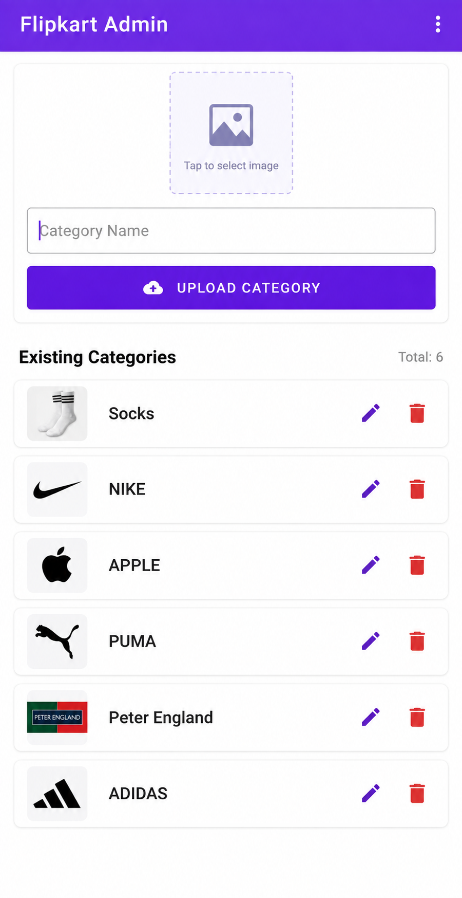
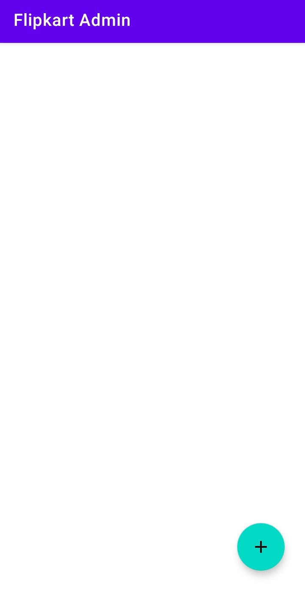
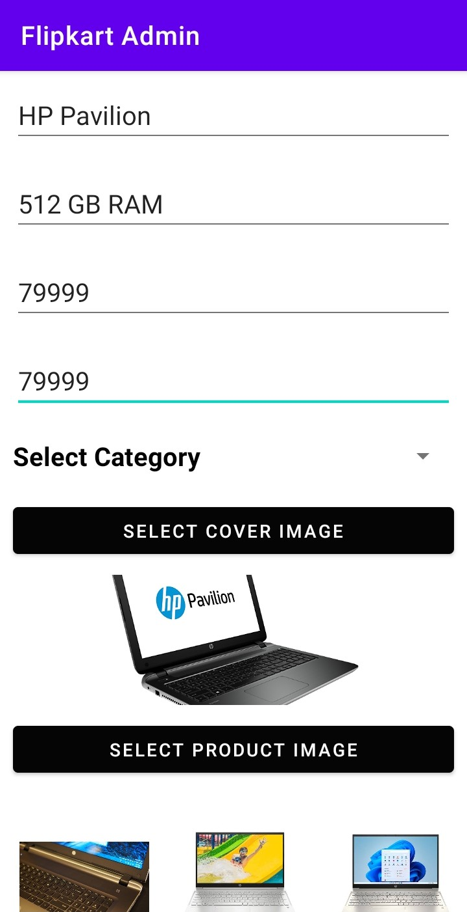
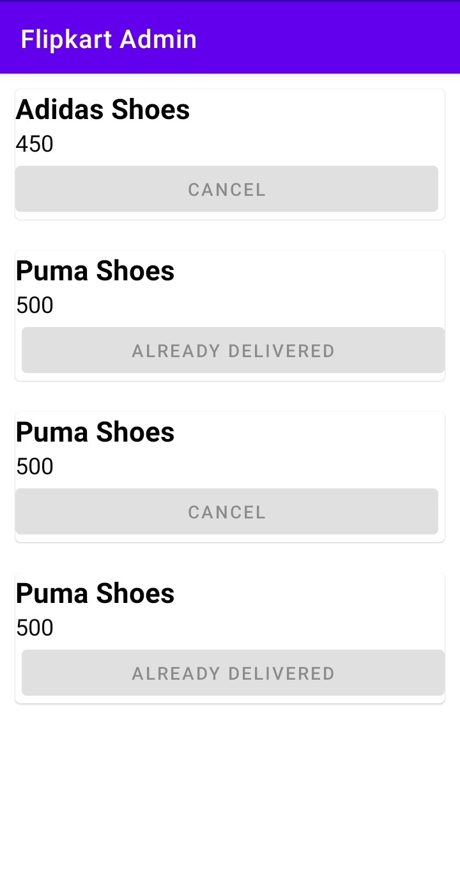

# SKART Admin - E-Commerce Management App

The admin companion app to [SKART](https://github.com/ShivamVerma19/E-commerce-App) — used to manage the products, categories, home-screen banners, and orders that the customer-facing app reads from. Built with **Kotlin, Firebase Firestore, and Firebase Storage**.

---

## 🚀 Features

✅ **Category Management** - Add product categories, each with its own image.
✅ **Product Management** - Add products with a cover image, multiple gallery images, name, description, category, MRP, and selling price.
✅ **Home Banner (Slider) Management** - Upload and manage the promotional image slideshow shown on the customer app's Home screen.
✅ **Order Viewing** - View all orders placed through the customer app.
✅ **Image Upload Pipeline** - Pick images from the device gallery, upload to Firebase Storage, and write the resulting download URLs into Firestore product/category documents.

---

## 🛠️ Technologies Used

- **Kotlin** (Programming Language)
- **Firebase Firestore** (categories, products, orders)
- **Firebase Storage** (product, category, and banner images)
- **Jetpack Navigation Component** (with Safe Args)
- **Glide** (image loading)
- **View Binding**

---

## 📸 Screenshots

<p align="center">
  
  
  
</p>
<p align="center"><em>Category · Add Product · Add Product Detail</em></p>

<p align="center">
  
</p>
<p align="center"><em>Order Detail</em></p>

---

## 📋 Setup Instructions

### 1️⃣ Clone the Repository

```bash
git clone https://github.com/ShivamVerma19/E-coomerce-Admin.git
```

### 2️⃣ Point It at the Same Firebase Project as SKART

- This app is meant to write to the **same** Firebase project as the [SKART customer app](https://github.com/ShivamVerma19/E-commerce-App), so data added here shows up there.
- Use your own Firebase project's `google-services.json` in the `app/` directory (replace the one in the repo).
- Make sure Firestore and Storage are enabled, and Storage read/write rules allow this app to upload (at minimum for testing).

### 3️⃣ Open in Android Studio & Run

- Open the project, let Gradle sync (min SDK 21, target SDK 32).
- Run on an emulator or device.

---

## 🔗 How It Works

### Adding a Product

- `AddProductFragment` lets you pick a cover image and multiple gallery images from the device via an image picker, along with product name, description, category, MRP, and selling price.
- On submit, images are uploaded to Firebase Storage; their resulting download URLs are written into a Firestore product document (`AddProductModel`).

### Category & Slider Management

- `CategoryFragment` and `SliderFragment` follow the same pattern — pick an image, upload to Storage, write the URL to Firestore — for categories and the home-screen banner slideshow respectively.

### Orders

- `AllOrderActivity` reads and displays orders that were written to Firestore by the customer-facing SKART app at checkout.

---

## 🔗 Related Repository

This app is the admin counterpart to **[SKART (customer app)](https://github.com/ShivamVerma19/E-commerce-App)** — the two share the same Firebase backend: products/categories/banners added here appear in the customer app, and orders placed there appear here.

---

## 🔥 Future Enhancements

✅ Authentication/role-based access so only authorized admins can use the app.
✅ Edit/delete existing products and categories, not just add new ones.
✅ Order status updates (mark as shipped/delivered) from this app.

---

## 💡 Contributors

**Shivam Verma** - [GitHub](https://github.com/ShivamVerma19)
